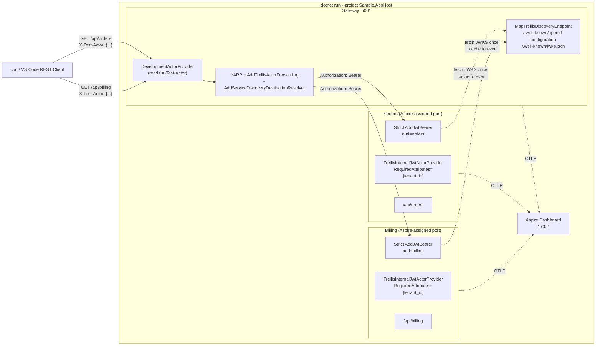
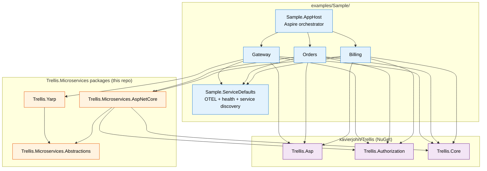
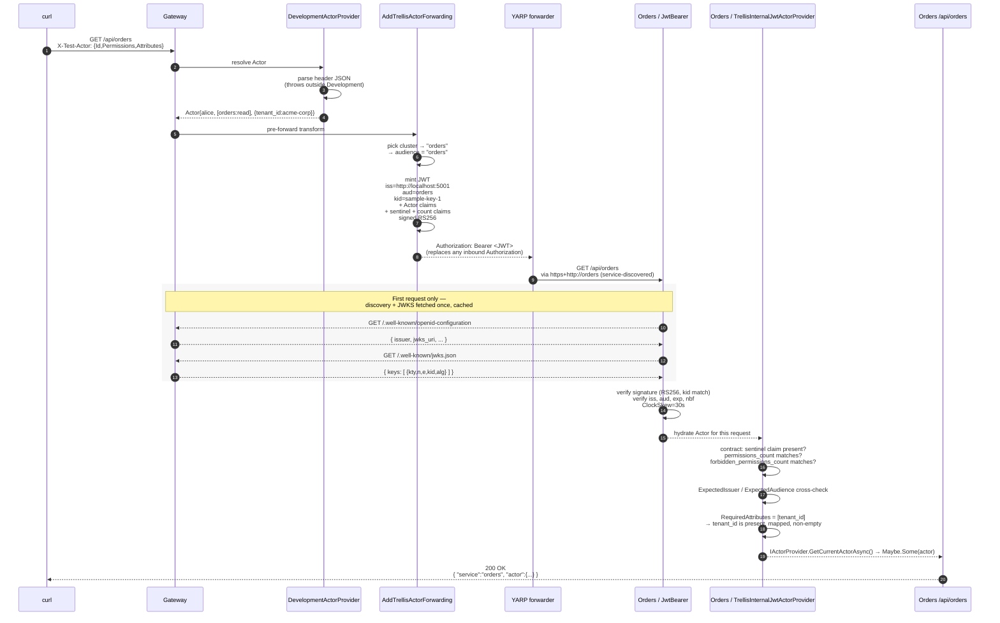
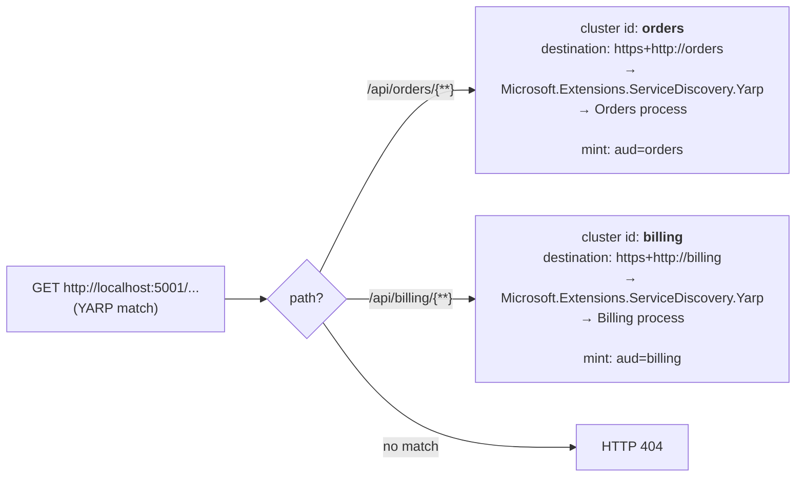
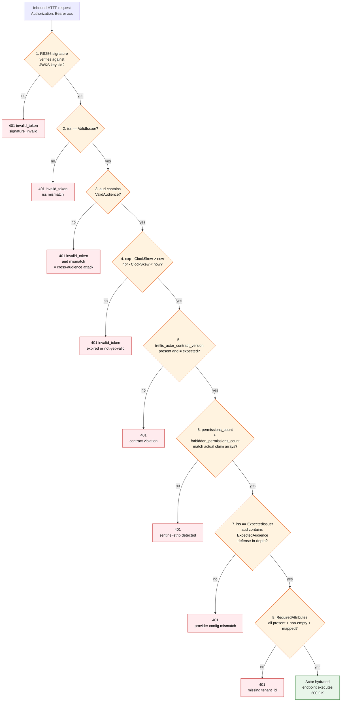
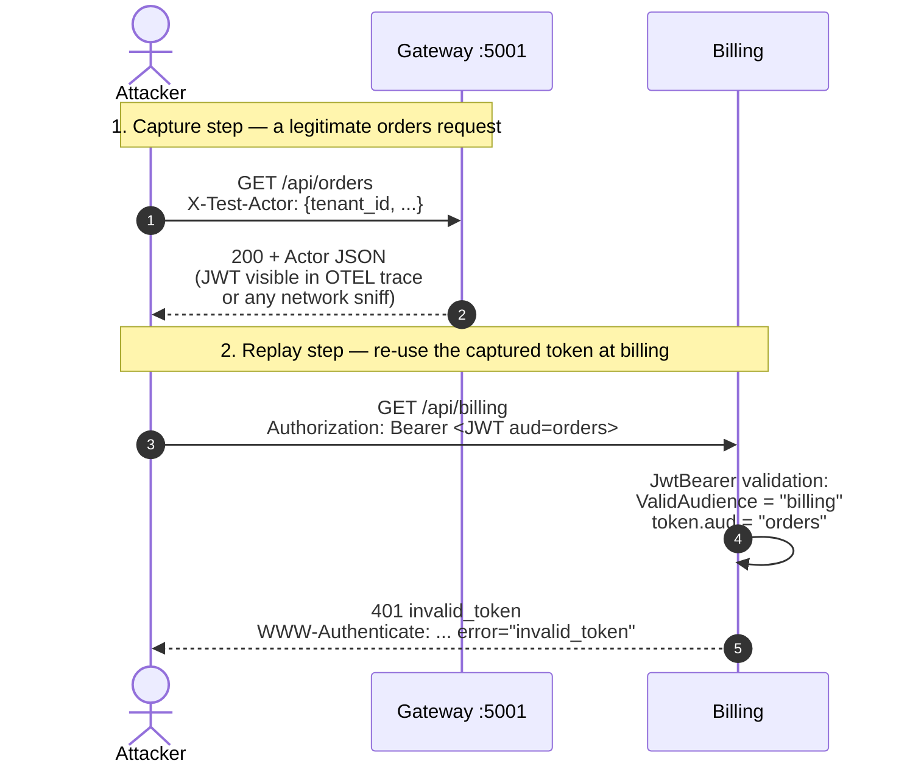
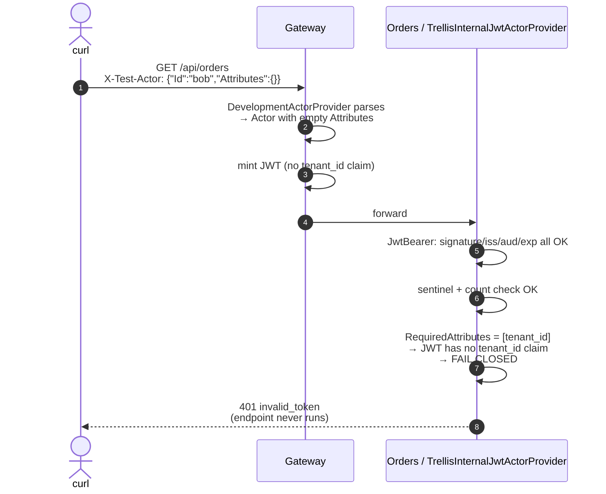
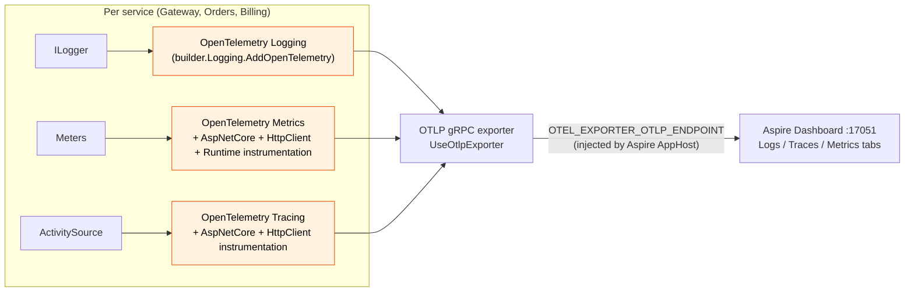

# Sample architecture

A diagram-first deep dive into what actually happens when you run `dotnet run --project Sample.AppHost` and curl the gateway. [`README.md`](./README.md) is the quick-start; this file is the why-and-how.

> All diagrams below render as Mermaid in GitHub's web UI, VS Code (with the built-in Markdown preview ≥ Aug 2022), and any modern docs viewer.

- [1. System view](#1-system-view)
- [2. Project + dependency graph](#2-project--dependency-graph)
- [3. Happy-path request sequence](#3-happy-path-request-sequence)
- [4. YARP routing table](#4-yarp-routing-table)
- [5. The strict consumer validation pipeline](#5-the-strict-consumer-validation-pipeline)
- [6. JWT shape — what the gateway mints](#6-jwt-shape--what-the-gateway-mints)
- [7. Cross-audience attack — what fail-closed looks like](#7-cross-audience-attack--what-fail-closed-looks-like)
- [8. Missing `tenant_id` attack — `RequiredAttributes` in action](#8-missing-tenant_id-attack--requiredattributes-in-action)
- [9. Aspire telemetry pipeline](#9-aspire-telemetry-pipeline)
- [10. Why per-cluster audiences and why dynamic JWKS](#10-why-per-cluster-audiences-and-why-dynamic-jwks)

## 1. System view

Aspire AppHost orchestrates three ASP.NET Core processes and the dashboard. The Gateway re-mints a per-cluster JWT for every inbound request and proxies via YARP. Downstream services fetch the gateway's signing keys via OIDC discovery and validate every JWT statelessly — no shared secret, no cookie, no DB lookup on the hot path.



**Key invariants visible above:**

- The Gateway is the **only** process that holds the signing key. Downstream services hold only the (public) JWKS.
- Each downstream pins a DIFFERENT audience. The Gateway derives audience from the YARP cluster ID. A token minted for cluster `orders` cannot pass `ValidAudience = "billing"` on the Billing side (see §7).
- Both downstreams require `tenant_id` — if the gateway mint ever omitted it, the request fails closed before the endpoint runs (see §8).

## 2. Project + dependency graph

Five sample projects, two packages from this repo, three upstream Trellis packages. The arrows show `<ProjectReference>` / `<PackageReference>` direction.



**Who needs what:**

| Project | Why those deps |
|---|---|
| `Sample.AppHost` | References the three runnable projects so Aspire can boot them and inject service-discovery env vars via `WithReference`. |
| `Sample.ServiceDefaults` | Aspire-standard pattern: a single `AddServiceDefaults()` call that every service shares. Owns OTEL exporter wiring, HttpClient resilience, service-discovery resolution, health-check endpoints. |
| `Gateway` | `Trellis.Yarp` for `AddTrellisActorForwarding` + `MapTrellisDiscoveryEndpoint`. `Trellis.Asp` for `AddDevelopmentActorProvider`. `Trellis.Authorization` for `Actor`. `Trellis.Core` for `Result`/`Maybe`. |
| `Orders`, `Billing` | `Trellis.Microservices.AspNetCore` for `AddTrellisInternalJwtActorProvider`. Same upstream stack as Gateway. |

## 3. Happy-path request sequence

Step-by-step trace of a single `GET /api/orders` from `curl` to the JSON response.



**Where each invariant is enforced** (numbered to match the diagram):

| Step | Invariant | Enforced by |
|---|---|---|
| 6 | Per-cluster audience pinning | `AudiencePerCluster = c => c.ClusterId` in Gateway/Program.cs |
| 7 | Token-replay floor (jti + tight expiry + RS256) | `Trellis.Yarp.TrellisActorJwtMinter` |
| 7 | Reserved-claim guard (no overlap with Trellis structural claims) | `Trellis.Yarp.TrellisActorJwtMinter` |
| 11–14 | Lazy JWKS fetch & cache | `Microsoft.AspNetCore.Authentication.JwtBearer` (built-in) |
| 15 | Algorithm pin + kid match | `TokenValidationParameters.ValidAlgorithms = [RsaSha256]`, `TryAllIssuerSigningKeys = false` |
| 15 | Issuer + audience + lifetime | `TokenValidationParameters.{ValidateIssuer,ValidateAudience,ValidateLifetime}` all `true` |
| 17 | Sentinel + count contract claims | `TrellisInternalJwtActorProvider` |
| 18 | Defense-in-depth issuer/audience cross-check | `TrellisInternalJwtActorOptions.{ExpectedIssuer,ExpectedAudience}` |
| 19 | `tenant_id` MUST be present | `TrellisInternalJwtActorOptions.RequiredAttributes` |

## 4. YARP routing table

The Gateway's `appsettings.json` defines two routes mapped to two clusters. The cluster ID determines the JWT audience the gateway will mint for forwarded requests.



**`https+http://orders` resolution chain:**

1. YARP `AddServiceDiscoveryDestinationResolver()` plugs the service-discovery resolver into YARP's destination pipeline.
2. The resolver consults `Microsoft.Extensions.ServiceDiscovery` configuration providers.
3. The Aspire AppHost's `WithReference(orders)` injected env vars like `services__orders__http__0=http://localhost:NNNNN` into the Gateway process before it started.
4. The resolver returns the literal `http://localhost:NNNNN` to YARP, which forwards.

Outside Aspire, the same `https+http://orders` URL falls back to plain DNS / hosts-file resolution (so you could run the Gateway standalone with `127.0.0.1 orders billing` in your hosts file if you wanted to).

## 5. The strict consumer validation pipeline

Every inbound request to Orders/Billing flows through this gauntlet. Any failure → 401 with no body, no leak. The numbered checks below match the rows in Recipe 1 of the microservices cookbook.



**Steps 1–4 are the JwtBearer middleware** — standard ASP.NET Core. **Steps 5–8 are `TrellisInternalJwtActorProvider`** — the framework's defense-in-depth layer that catches mistakes the standard JWT validation cannot (sentinel/count integrity, tenant_id presence, issuer/audience cross-check separate from the transport layer).

## 6. JWT shape — what the gateway mints

A concrete example of the JWT for a `GET /api/orders` from `alice` with `tenant_id=acme-corp`:

```jsonc
// Header (base64url-decoded)
{
  "alg": "RS256",
  "kid": "sample-key-1",
  "typ": "JWT"
}

// Payload (base64url-decoded)
{
  // Standard JWT claims
  "iss": "http://localhost:5001",          // matches Gateway/Program.cs Issuer + ServiceJwtBearer ValidIssuer
  "aud": "orders",                         // matches the YARP cluster id (per-cluster pinning)
  "exp": 1780_xxx,                         // now + 5 minutes (Lifetime in Gateway/Program.cs)
  "iat": 1780_xxx,
  "nbf": 1780_xxx,
  "sub": "alice",                          // Actor.Id
  "jti": "ed0a0eb7eab347b1a4e315e9bb45de0a",  // unique per mint — replay-deterrence

  // Trellis contract claims — the framework's integrity sentinels
  "trellis_actor_contract_version": "1",
  "trellis_permissions_count": "2",        // declared count for tamper detection
  "trellis_forbidden_permissions_count": "1",

  // Actor projection
  "permissions": ["orders:read", "orders:write"],
  "forbidden_permissions": ["orders:delete"],

  // ABAC attributes (projected via AttributeClaimMap on the consumer side)
  "tenant_id": "acme-corp"
}

// Signature: RS256 over base64url(header) + "." + base64url(payload), signed
// with the gateway's RSA private key. The public component is published at
// /.well-known/jwks.json so consumers verify statelessly.
```

**Why count claims exist:** if a malicious proxy stripped `forbidden_permissions` but left `forbidden_permissions_count: "1"`, the consumer detects the mismatch (count says 1, actual array has 0) and fails closed. Without the sentinel, the consumer would silently treat the stripped-forbidden-permission set as the truth — a deny-overrides-allow contract violation. See `examples/E2EHarness` scenario 4 for the regression test.

## 7. Cross-audience attack — what fail-closed looks like

Hypothetical attacker captures an `aud=orders` JWT and replays it directly against the Billing service. The framework's per-cluster audience pinning blocks it transparently.



**Why this matters:** without per-cluster audiences, every downstream would share one audience (say `"internal"`) and a token captured from one service trivially grants access to all the others. With `AudiencePerCluster = c => c.ClusterId`, each downstream pins a unique audience and the blast radius of any captured token is one cluster.

To see this in action: edit `Billing/Program.cs`, change `o.Audience = "billing"` to `"orders"`, restart Aspire, hit `/api/billing` — you'll get 200 (because Billing now wrongly accepts orders tokens). Revert, restart, hit again — 401.

## 8. Missing `tenant_id` attack — `RequiredAttributes` in action

A gateway-side mistake (or a malicious actor with control over `X-Test-Actor`) could produce a JWT with no `tenant_id`. The downstream's `RequiredAttributes` config fails the request closed.



**Why this matters:** a downstream service that reads `actor.Attributes["tenant_id"]` with a default/wildcard fallback would silently cross tenants if a mint accidentally omitted the claim. Putting `tenant_id` in `RequiredAttributes` makes "tenant unknown" mean 401, not "queries all tenants".

## 9. Aspire telemetry pipeline

Every service in the sample shares `Sample.ServiceDefaults` which wires:



**What you actually see in the dashboard:**

- **Resources tab** — `gateway`, `orders`, `billing` each "Running" with their endpoints. The AppHost-injected service-discovery env vars are visible in the Environment subtab.
- **Console tab** — raw stdout per service, including the Gateway's `kid=sample-key-1, iss=..., aud=orders, permissions_count=N, forbidden_permissions_count=N` mint log.
- **Structured logs tab** — same data indexed, filterable by resource / level / property.
- **Traces tab** — every curl creates one trace. A single `/api/orders` trace contains: `gateway POST /api/orders` (root) → `gateway HTTP forward` → `orders incoming GET /api/orders` → `orders auth + endpoint span`. The `traceparent` header propagates automatically because `HttpClientInstrumentation` adds it and `AspNetCoreInstrumentation` reads it.
- **Metrics tab** — per-service request counts, latency histograms, GC / CPU / runtime metrics.

The first `/api/orders` curl also produces a JWKS-fetch span from Orders → Gateway: useful evidence that the discovery doc + JWKS were fetched once on the first request and cached for the rest.

## 10. Why per-cluster audiences and why dynamic JWKS

Two design decisions that look like extra ceremony but pay off when the system grows.

### Per-cluster audiences (`AudiencePerCluster = c => c.ClusterId`)

| Choice | Consequence |
|---|---|
| One shared audience (`"internal"`) | Single captured token = full lateral movement. Adding a service requires zero crypto changes. **Convenience for the attacker.** |
| Audience-per-cluster | Captured token = one-cluster blast radius. Adding a service requires zero crypto changes (cluster ID is the audience automatically). Defense-in-depth at the audience layer is free. |

### Dynamic JWKS via OIDC discovery (`o.Authority = "..."`)

| Choice | Consequence |
|---|---|
| Pinned `IssuerSigningKey` literal | Key rotation requires a deploy of every consumer. **Operational nightmare.** |
| Dynamic JWKS fetch | Consumers learn the key from `/.well-known/jwks.json` at first request, refresh on TTL. Key rotation is a Gateway-only operation. `PreviousSigningKeys` for the rotation overlap window means zero consumer downtime. |

The E2E harness pins the key directly (it's a single-process test), but every production deployment should use the dynamic flow that this sample demonstrates. See Recipe 1's "Key-rotation runbook" in the [microservices cookbook](../../docs/docfx_project/api_reference/trellis-api-microservices-cookbook.md) for the operational walkthrough.

---

## Where to go from here

| Want to... | Read |
|---|---|
| Run the sample | [`README.md`](./README.md) |
| Click-to-send sample requests | [`Sample.http`](./Sample.http) |
| Author your own consumer | Recipe 1 in [`trellis-api-microservices-cookbook.md`](../../docs/docfx_project/api_reference/trellis-api-microservices-cookbook.md) + [`trellis-api-internal-jwt.md`](../../docs/docfx_project/api_reference/trellis-api-internal-jwt.md) |
| Author your own gateway | Recipe 2 in the cookbook + [`trellis-api-yarp.md`](../../docs/docfx_project/api_reference/trellis-api-yarp.md) |
| Run release-gate regression tests | [`examples/E2EHarness/README.md`](../E2EHarness/README.md) |
| Scaffold a new microservice from a template | (Future) `xavierjohn/Trellis.Microservices.Template` — currently parked |
